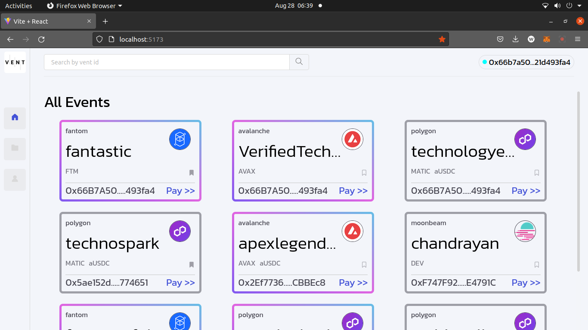
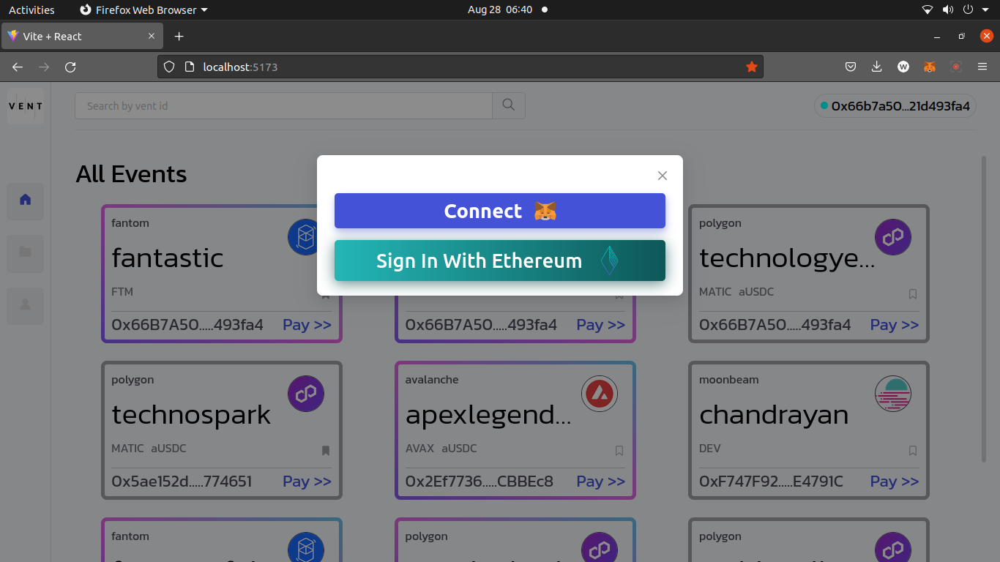
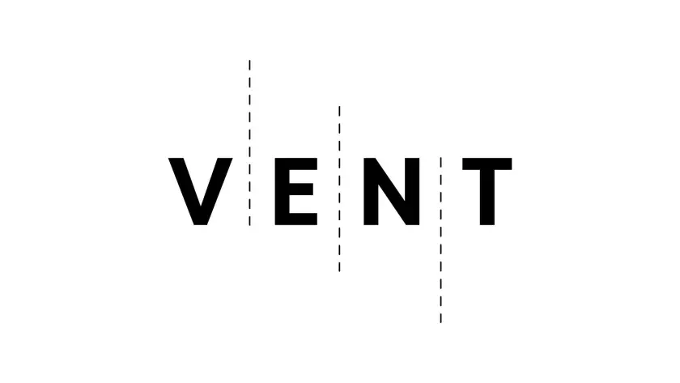

# Vent: Cross-Chain Event Management and Payment Platform
## Vent - Fusing (E)vents with Cross-Chain Connectivity. Just like Vent connects spaces, we connect Ethereum, Avalanche, Polygon, Fantom and Moonbase
SWAP & SEND: If it makes error on moonbeam, fantom. Then try swap on avalanche, polygon, goerila for confirmation (SWAP is more active on these chains)

Vent is an innovative cross-chain multi-chain DeFi dApp that revolutionizes event organization and payment management. It empowers event organizers to streamline operations and offers users versatile payment methods. By leveraging cutting-edge technologies, including Spruce ID for event verification, Vent ensures security, inclusivity, and efficient transactions.

[**Youtube video**](https://www.youtube.com/watch?v=eP0ieXtfaEg)

## Features

- **Event Organization Structure:** Create events with an owner and a team of up to four members. Each team member has predefined spending limits for effective budget management.

- **Payment Methods:**
  - **Direct Pay:** Traditional payment method using a specified currency.
  - **Cross-Chain AUSDC Transfer:** Utilize Axelar's GMP_with_token for borderless transactions.
  - **Squid Swap & Axelar Native Swap:** Seamlessly swap assets across different blockchains.

- **Spruce ID Verification:** Enhance security and authenticity by integrating Spruce ID for event verification, ensuring trustworthy and verified events.
  

## Architecture

### Frontend

- Framework: React
- State Management: Hooks
- Web3 Integration: ethers.js
- Chains: Avalanche, Ethereum Goerli, Polygon, Fantom, Moonbeam

### Backend

- Smart Contracts: Solidity
- Server: Node.js
- Database: MongoDB

### Libraries and Tools

- Axelar Network Libraries: GMP, GMP_with_token
- Squid Swap Integration
- Spruce ID Integration

## Getting Started

### Prerequisites

- Install [Node.js](https://nodejs.org/) and [npm](https://www.npmjs.com/).
- Install [Truffle](https://www.trufflesuite.com/truffle) for smart contract development.
- Set up your preferred blockchain networks (Ethereum, Binance Smart Chain, etc.).
- Obtain an [Axelar](https://axelar.network/) account for cross-chain transactions.

### Installation

1. Clone this repository: `git clone https://github.com/yourusername/vent.git`
2. Navigate to the project directory: `cd Vent`
3. Then again Navigate to `cd client`
4. Install dependencies: `npm install`
5. For database, Navigate to `cd server`
6. Install dependencies: `npm install`

### Usage

1. Deploy smart contracts: `truffle migrate`
2. Start the client: `npm start`
3. Start the server: `npm start`
4. Access Vent at [http://localhost:5173](http://localhost:5173).

## Contributing

Contributions are welcome! Please follow our [Contribution Guidelines](CONTRIBUTING.md).

## License
 
This project is licensed under the [MIT License](LICENSE).

## Contact

For inquiries, contact us at contact@ventapp.com.
